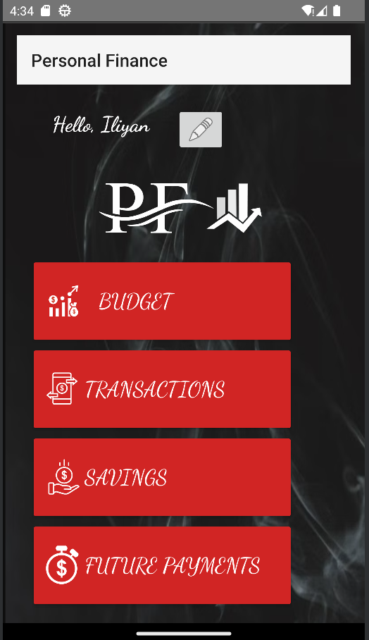
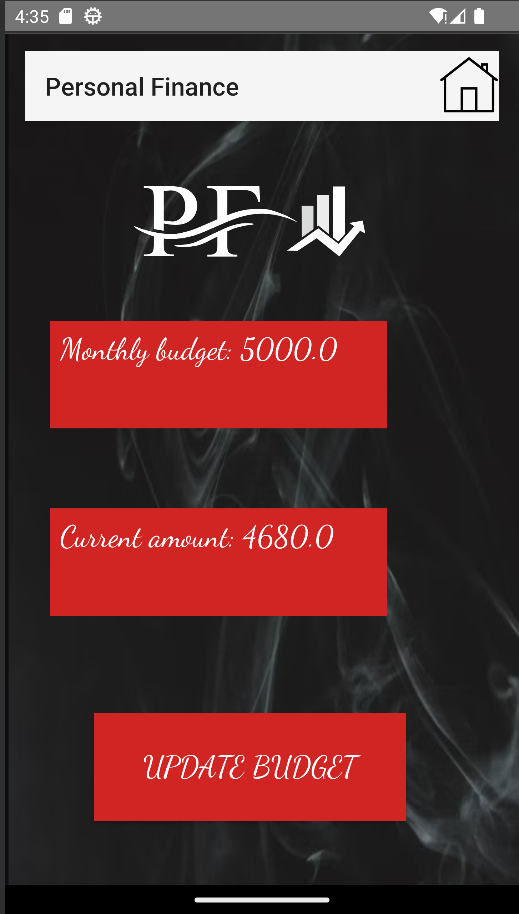
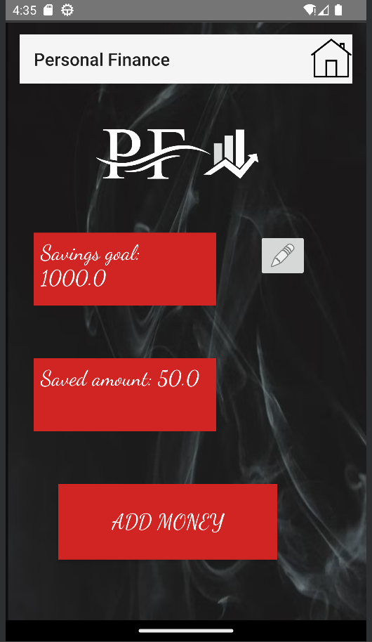
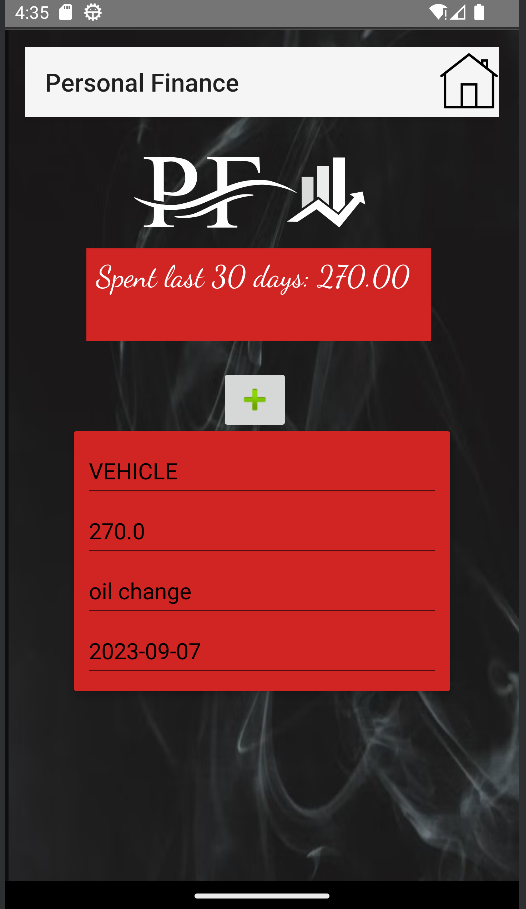
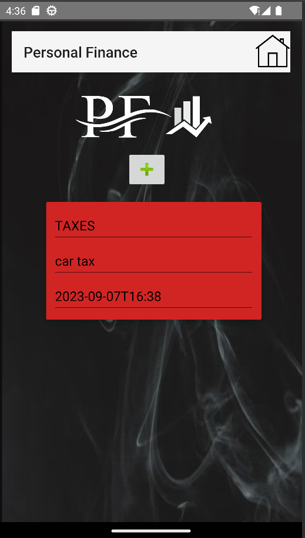
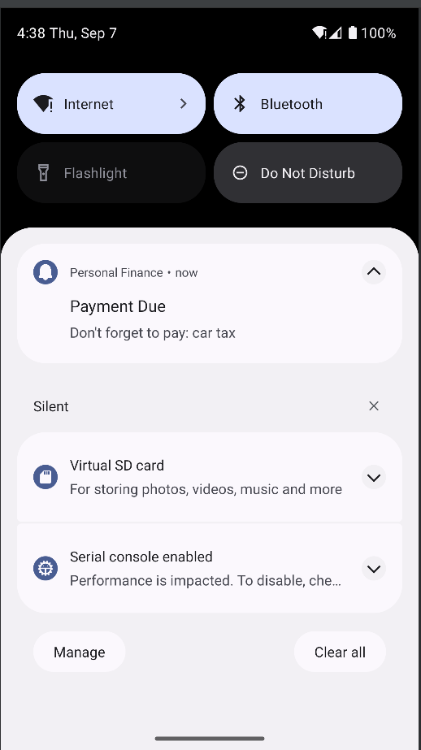

# Personal Finance App

Welcome to the Personal Finance App! This application is designed to help you manage your finances, budget effectively, and achieve your financial goals. Whether you're tracking daily expenses, planning for future payments, or setting savings goals, this app has got you covered.

## Table of Contents

- [Features](#features)
- [License](#license)

## Features

### Budgeting
- Create and manage your monthly budget with ease.
- Set spending limits for various expense categories.
- Get a clear overview of your budget status at a glance.

### Expense Tracking
- Log and categorize your daily expenses.
- Keep a record of where your money is going.
- View detailed expense reports and insights.

### Future Payments
- Schedule future payments and never miss a due date.
- Set up notifications to remind you of upcoming payments.
- Stay organized and plan your financial commitments in advance.

### Savings Goals
- Define your savings goals and track your progress.
- Allocate funds to different savings goals.
- Visualize your savings journey and celebrate milestones.

## Screenshots

*Screenshot 1: Displaying main activity*

*Screenshot 2: Displaying budget activity*

*Screenshot 3: Displaying savings activity*

*Screenshot 4: Displaying transactions activity*

*Screenshot 5: Displaying future payments activity*

*Screenshot 6: Displaying notification*

## License

This project is licensed under the [MIT License](LICENSE). Feel free to use, modify, and distribute it as per the terms of the license.

Thank you for choosing the Personal Finance App to take control of your financial journey! If you have any questions or feedback, please don't hesitate to reach out to me. Happy budgeting!
